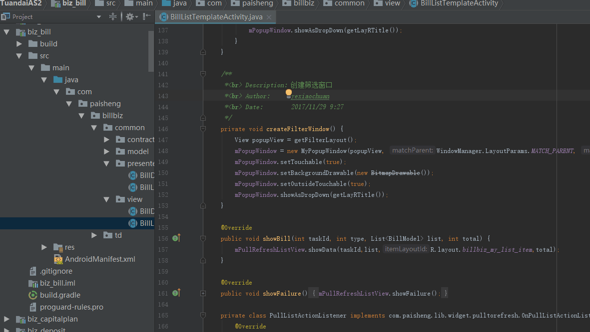
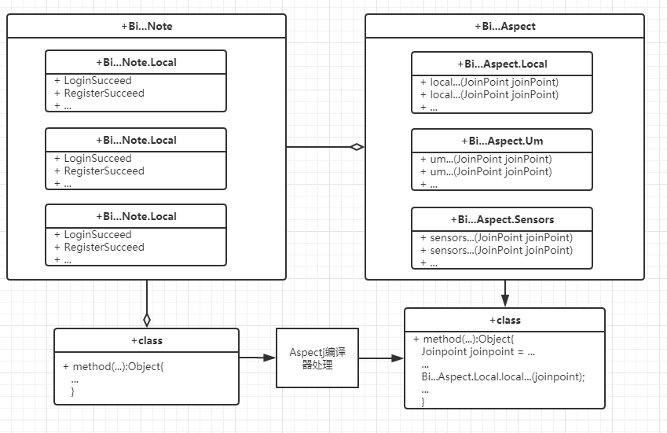

# TuandaiPlugin

## 演示
Bi代码自动生成


## 说明
- 本工具可以帮助团贷网APP开发人员快速生成繁杂的Bi代码

## 用法
1. 打开需要添加切入点的java文件，选中需要切入的方法的名称；
2. 如果方法有重载，将会弹窗提示用户选择需要的方法进行切入第，如果没有重载，跳过本步骤；
3. 弹出选择框，用户需要输入切入点需要生成的注解类的名称以及注释；
4. 可根据切入的BI需求，用户执行对切入方式，以及切入点方法的参数值是否获取进行配置
5. 点击确认生成    

## 如何开发示例：     
   
1、安装IDEA；
2、新建一个Project(选择 plugin):   

   

3、修改plugin配置文件：   

     

    
  
上图中圈中的就是插件代码的主入口，插件的名称，以及插件的位置(group-id)，    
上图的配置后，插件的位置在Generate菜单，如图：    

   

4、开始编写代码，这里以BI代码自动生成为案例，需求如下:       
a、选中需要切入Bi的方法，获取选中方法的名称；   
b、根据名称生成响应的注解，并在选中方法上添加该注解；   
c、针对注解，生成符合Aspectj的注入代码；  
类图如下：  


 
下面展示主要代码：    
>定义TuandaiBiPlugin继承AnAction    
```java
public class TuandaiBiPlugin extends AnAction {

    @Override
    public void actionPerformed(final AnActionEvent e) {
        // todo...
    }
}
```
在TuandaiBiPlugin类中的actionPerformed方法中，可以对整个项目，甚至IEAD做出一些更改， 这里仅仅  
>演示如何生成java代码：  
```java
public void actionPerformed(final AnActionEvent e) {
        // 获取Project
        Project project = e.getProject();
        if (project != null) {
            Editor editor = e.getData(PlatformDataKeys.EDITOR);
            if (editor != null) {
                // 获取选中的文本
                String mSelectedText = editor.getSelectionModel().getSelectedText();
                if (mSelectedText == null || mSelectedText.length() == 0) {
                    Messages.showInfoMessage("请选中需要切入Bi的方法名！", "提示");
                } else {
                    PsiFile psiFile = PsiUtilBase.getPsiFileInEditor(editor, project);
                    // 获取选中的PsiClass
                    final PsiClass psiClass = EditUtils.getPsiClass(editor, psiFile);
                    // 获取选中的类的方法
                    final PsiMethod[] psiMethods = psiClass.findMethodsByName(mSelectedText, false);
                    ...
                    // 配置需要生成的选中的方法的参数
                    CheckPointType.show(psiClass, psiMethods[0], new CheckPointType.CheckPointListener() {
                        public void checked(String className, List<CheckPointBean> list, String description) {
                            ...
                            // 写入文件
                            WriteToFile.write(e, psiClass, psiMethods[0], className, list, description);
                        }
                    });
                }
            }
        }
    }
```  
这里完成了当前选中方法的获取，以及弹出选择框，供用户选择一些配置（选择框可以使用javaSwing开发），   
>接下来就是代码的生成了：     
```java
WriteCommandAction.runWriteCommandAction(project, new Runnable() {
            public void run() {
                try {
                    // 创建文件系统
                    PsiClass[] virtualFiles = createFile(e);
                    // 写文件
                    if (virtualFiles != null) {
                        toWrite(project, virtualFiles, psiClass, selectMethod, className, list, description);
                    }
                } catch (final Exception e) {
                    System.out.println(e.getMessage());
                }
            }
        });
```  
这里需要注意的就是文件的生成在IDEA中需要放在异步线程;    
>Java文件的创建可以通过多种方式，比如VirtualFile、JavaDirectoryService(本例采用JavaDirectoryService)    
```java
private static PsiClass[] createFile(AnActionEvent e) {
        Project project = e.getProject();
        // 取得当前Moudule
        Module mModule = e.getData(LangDataKeys.MODULE);
        if (project != null && mModule != null) {
            // 取得当前Moudule的名称
            String ModuleName = mModule.getName();
            // 创建指定目录
            String src = ModuleName + "/src/bi/java/bi";
            try {
                // 获取virtualFileDirectory
                VirtualFile virtualFileDirectory = ProjectHelper.createFolderIfNotExist(project, src);
                // 获取biPsiDirectory
                PsiDirectory biPsiDirectory = PsiManager.getInstance(project).findDirectory(virtualFileDirectory);
                if (biPsiDirectory != null) {
                    // 查找该目录下是否有Aspect和Note文件
                    PsiFile[] psiFiles = getAspectAndNote(biPsiDirectory);
                    // 获取要定义的类名
                    String[] classNames = getFormatName(ModuleName.replaceAll("[Bb]iz_", ""));
                    // 定义PsiClass数组
                    PsiClass[] PsiClassArray = new PsiClass[2];
                    // 查找PsiFile
                    PsiFile psiFile1 = psiFiles[0];
                    if (psiFile1 instanceof PsiJavaFile) {
                        // 赋值
                        PsiClassArray[0] = ((PsiJavaFile) psiFile1).getClasses()[0];
                    } else {
                        // 创建
                        PsiClassArray[0] = JavaDirectoryService.getInstance().createClass(biPsiDirectory, classNames[0].replace(".java", ""));
                    }
                    //  查找PsiFile
                    PsiFile psiFile2 = psiFiles[1];
                    if (psiFile2 instanceof PsiJavaFile) {
                        // 赋值
                        PsiClassArray[1] = ((PsiJavaFile) psiFile2).getClasses()[0];
                    } else {
                        // 创建
                        PsiClassArray[1] = JavaDirectoryService.getInstance().createAnnotationType(biPsiDirectory, classNames[1].replace(".java", ""));
                    }
                    // 加入编辑器
                    return PsiClassArray;
                }
            } catch (IOException e1) {
                e1.printStackTrace();
            }
        }
        return null;
    }
```   
这里创建了或者获取了两个PsiClass对象，一个是Bi...Aspect（存放切入逻辑），一个是Bi...Note（存放切入注解）;     
>再看获取了这两个PsiClass对象对象后，如何操作插入代码, 先看Note:    
```java
private void start() {
        PsiModifierList modifierList = psiClass.getModifierList();
        if (modifierList != null) {
            if (!modifierList.hasModifierProperty(PsiKeyword.PUBLIC)) {
                modifierList.add(psiElementFactory.createKeyword(PsiKeyword.PUBLIC));
                modifierList.addBefore(psiElementFactory.createAnnotationFromText("@Retention(RetentionPolicy.CLASS)", null), modifierList.getFirstChild());
                modifierList.addBefore(psiElementFactory.createAnnotationFromText("@Target({ElementType.METHOD})", null), modifierList.getFirstChild());
            }
        }
    }
```  
这里在注解类Note上加入了public、以及注解类型等标签，需要注意像修饰符以及注解都是通过ModifierList添加或者删除的；   
```java
private void sensors(CheckPointBean item) {
        PsiClass psiClassSensors = psiClass.findInnerClassByName("Sensors", true);
        boolean isWillBeAdd = false;
        if (psiClassSensors == null) {
            String str = String.format(constant.ASPECT_ANOTE, "神测注解类", "Sensors");
            psiClassSensors = psiElementFactory.createClassFromText(str, null).getInnerClasses()[0];
            isWillBeAdd = true;
        }

        toAddSubA(psiClassSensors, isWillBeAdd);
    }
```     
获取Note类中是否已经有Sensors之类，如果没有，则创建，有则直接或者，创建的时候可以直接根据字符串创建（这个相当方便），     
有几点需要注意：    
1、通过psiElementFactory.createClassFromText创建的类，传入的字符串，会做为整个类的内部类容，也就是说，    
createClassFromText创建的类目前返回的还是一个匿名类，你需要去对这个类进行一系列的修饰符的配置；   
2、这里采取了巧妙的手段，直接在这个匿名类中，生成了一个内部类，我们只把这个内部类取出来即可；   
3、任何元素，在添加到父元素后，再对这个元素的修改不会同步到父元素（猜测父元素添加的只是元素的Copy值），     
如果需要再次修改，需要重新从父元素中取出该元素进行修改。    
```java
private void toAddSubA(PsiClass psiClassParent, boolean isWillBeAdd) {
        PsiClass psiClassSub = psiClassParent.findInnerClassByName(annotationName, true);
        if (psiClassSub == null) {
            String str = String.format(constant.ASPECT_ANOTE, classDescription, annotationName);
            psiClassSub = psiElementFactory.createClassFromText(str, null).getInnerClasses()[0];
            psiClassParent.add(psiClassSub);
        } else {
            throw new RuntimeException(psiClassParent.getName() + "类中，注解类" + annotationName + "已存在");
        }
        if (isWillBeAdd) {
            psiClass.add(psiClassParent);
        }
    }
```     
根据上面的注意事项可以看到，如果psiClassParent是新创建的，这里不是先添加到父元素，而是在它本身完成创建和      
元素添加之后，最后才添加到父元素的。

>至于Aspect及当前编辑类的更改，修改方式都是一样的，需要注意的地方，上面也有提及，这里就不再做解读了；    
这里还要提到的就是继承自AnAction的类是全局单利的，使用的时候需要注意。

## 总结：   
关于IDEA插件的编写，这里也是初步入门的示例，总结了一些代码自动生成方面的注意事项，因为官方文档基本没有，    
这里推荐大家直接去阅读一些优秀的插件源码。Email：32038305@qq.com